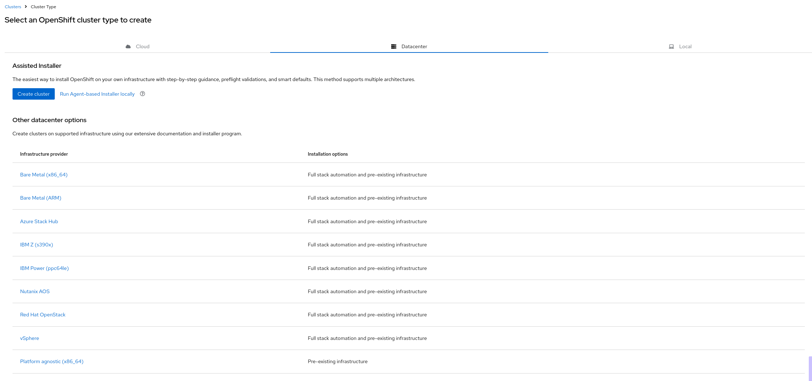
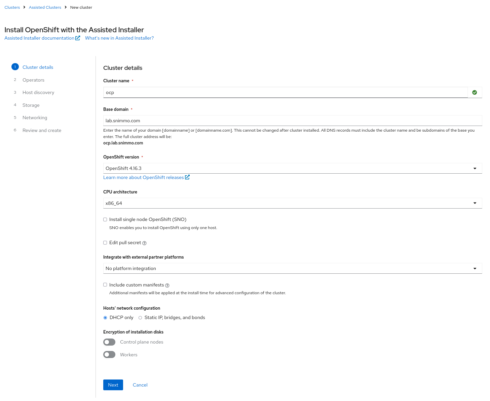
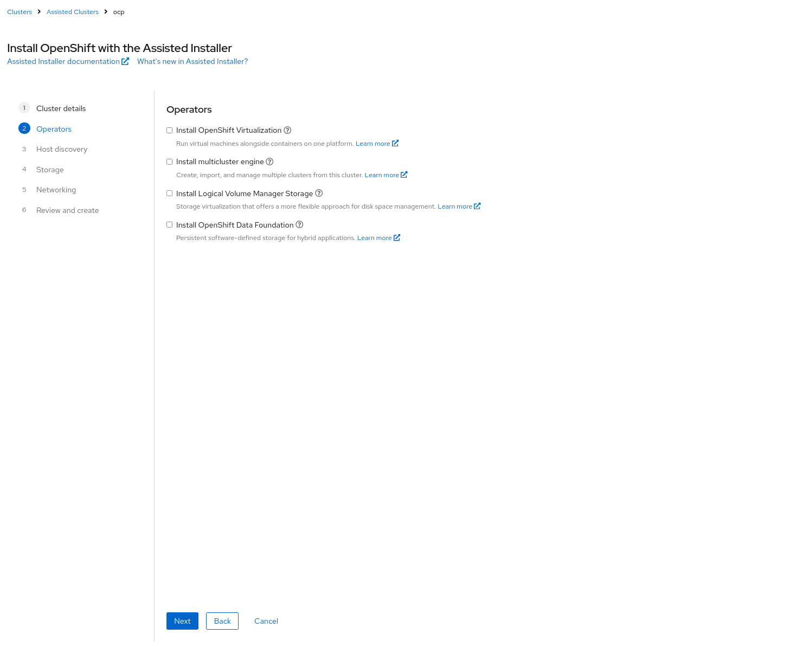
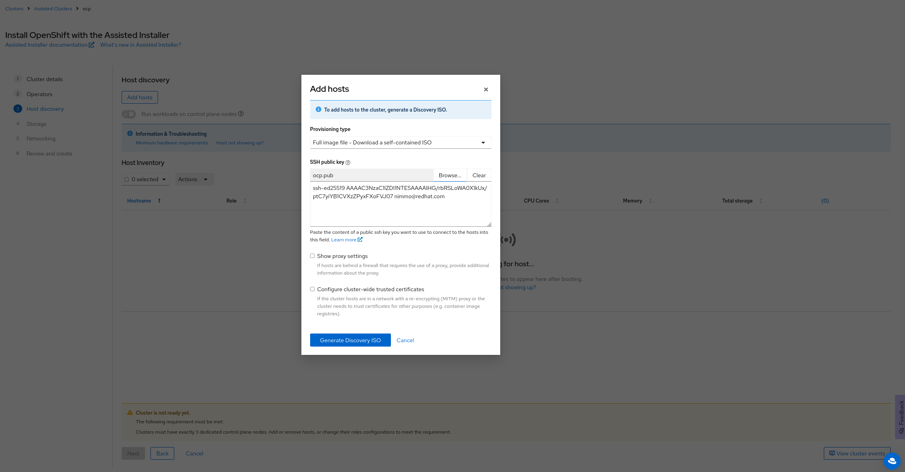
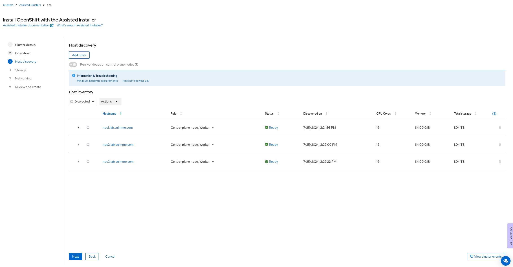
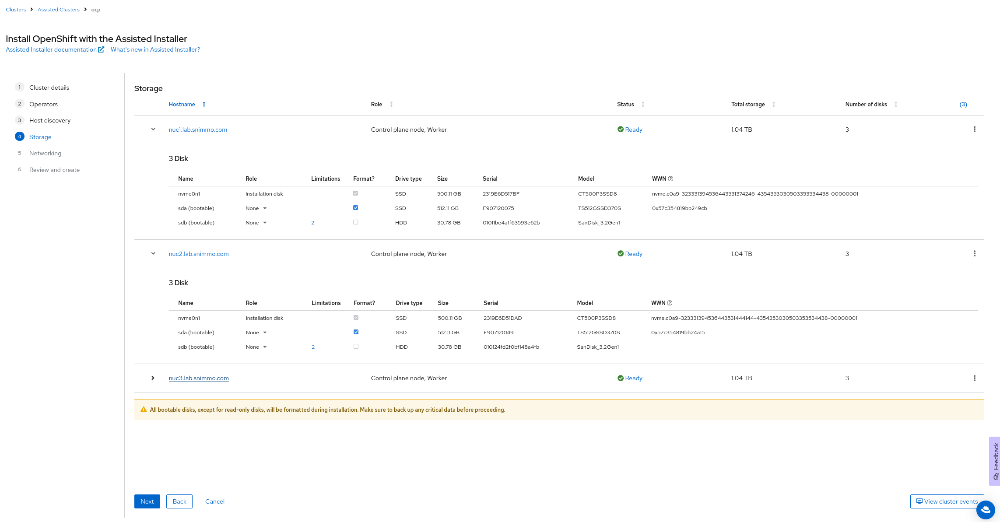
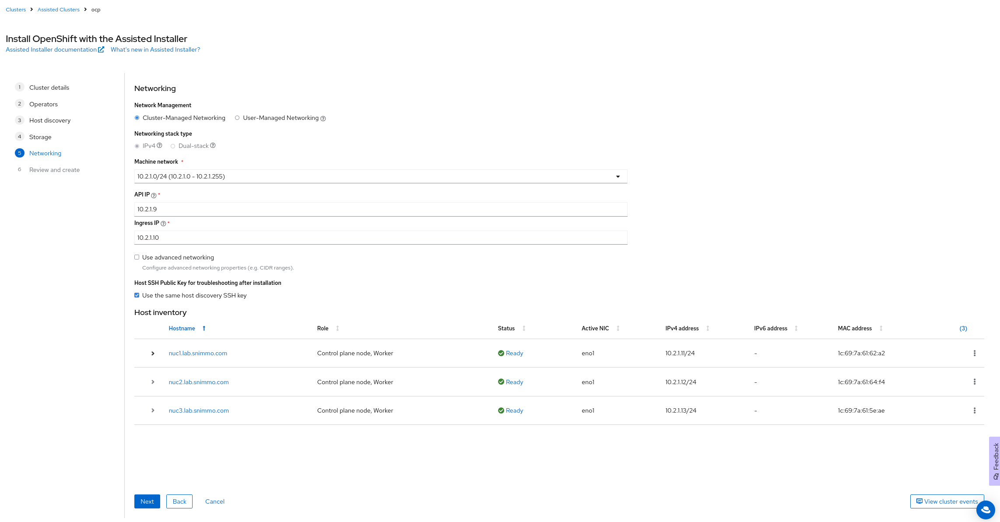
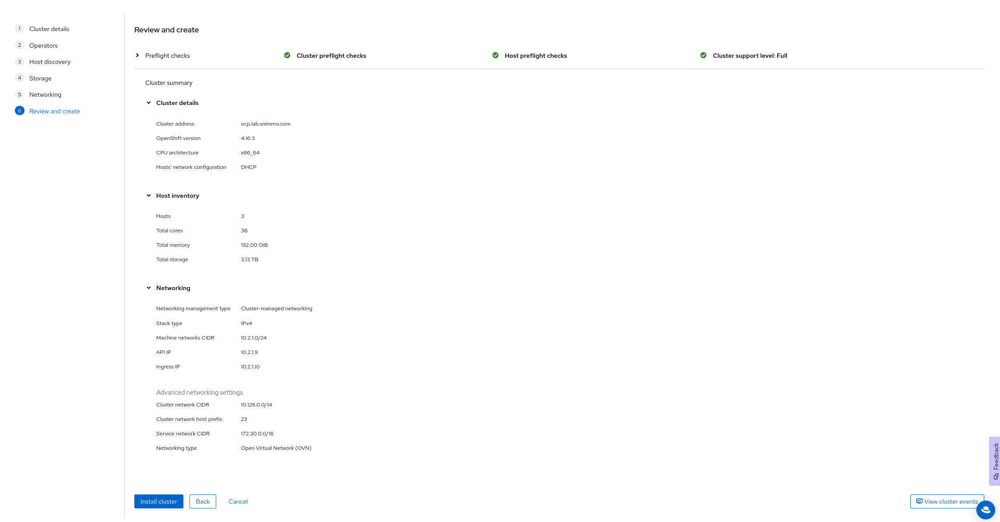
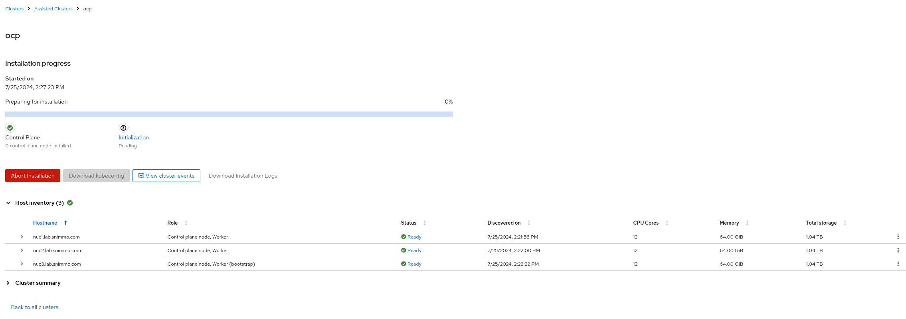

# Using the assisted installer

## Prerequisites

### Hardware
6 Nodes - 3 Control Plane, 3 Workers

For all nodes: 
* macaddress and IP address
* Install disk located at /dev/sda

Worker nodes:
* Additional disk for ODF

### DNS

Two VIPs Needed
* API: 
* Ingress: 

# Install

Boot the boxes with the generated ISO and they will show up in the host inventory.

Select the Installaion disks and format the other disks (node 3 hidden for image sizing)

Fill out networking information

Review and press Install Cluster

Wait...

## Day 2 Tasks

Install ODF

https://docs.redhat.com/en/documentation/red_hat_openshift_data_foundation/4.15/html/deploying_openshift_data_foundation_using_bare_metal_infrastructure/deploy-using-local-storage-devices-bm

Configure the Registry

https://docs.openshift.com/container-platform/4.15/registry/configuring-registry-operator.html

