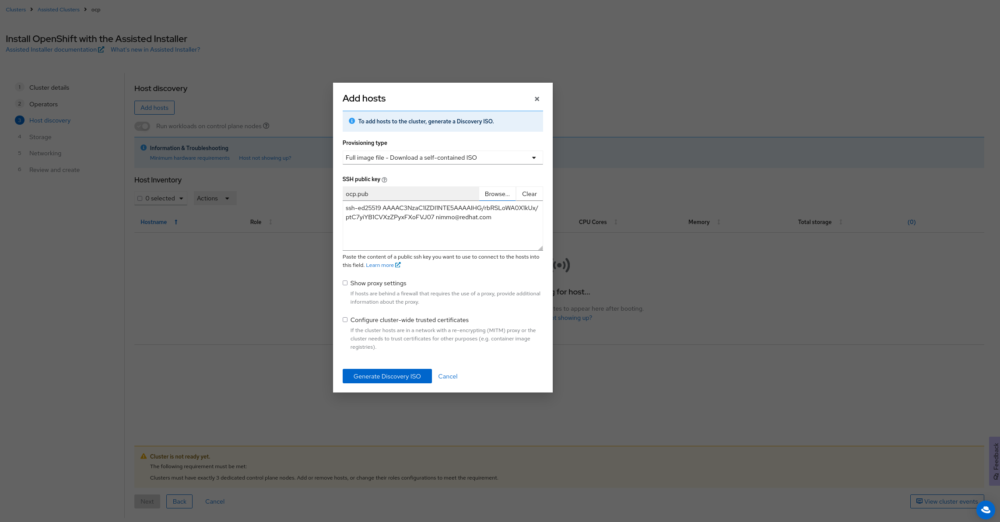
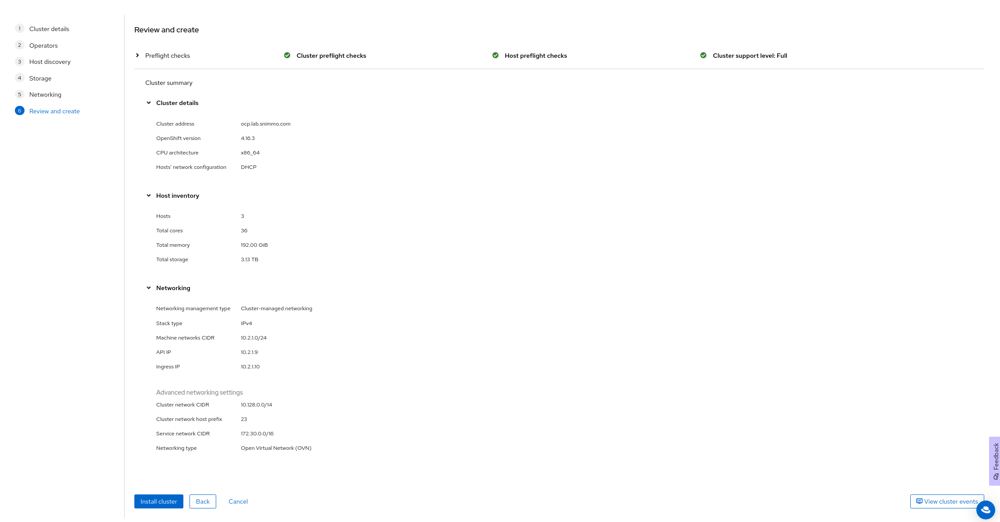

# Using the assisted installer

## Prerequisites

### Hardware

6 Nodes - 3 Control Plane, 3 Workers  
MIN - 4 vCPU, 16 GB RAM, 100 GB install disk w/ 300 IOPS, 1 TB persistent storage disk

For all nodes: 

* Networking (IPAM)
    * DHCP (Recommended)
    * Static: macaddress and IP address for each machine
* Disks
    * Install disk located at /dev/sda
    * For worker nodes, additional persistent storage disk for ODF

### Networking 
Machine subnet (/24)  
Two VIPs (API, Ingress)

### Certificates (Recommended)
API certificate (api.clustername.basedomain.com)
Ingress wildcard certificate (*.apps.clustername.basedomain.com)
Ingress wildcard certificate (root CA certificate)

<br/>

## Install

Go to <a href="https://console.redhat.com/openshift/assisted-installer" target="_blank">https://console.redhat.com/openshift/assisted-installer</a>. Click on Create Cluster


Move to Datacenter tab and click on Create Cluster


Imput the basic information about the cluster. 


Don't select any operators. We will install those Day 2. 


Click on the Add Hosts button to generate the ISO


Select Full Image and generate the iso, then save it



Boot the boxes with the generated ISO and they will show up in the host inventory.


Select the Installaion disks and format the other disks (node 3 hidden for image sizing)


Fill out networking information


Review and press Install Cluster



Wait...


Success!


### Postinstall Cleanup 

```shell
oc delete pods --field-selector status.phase=Failed -A
oc delete pods --field-selector status.phase=Succeeded -A
``` 