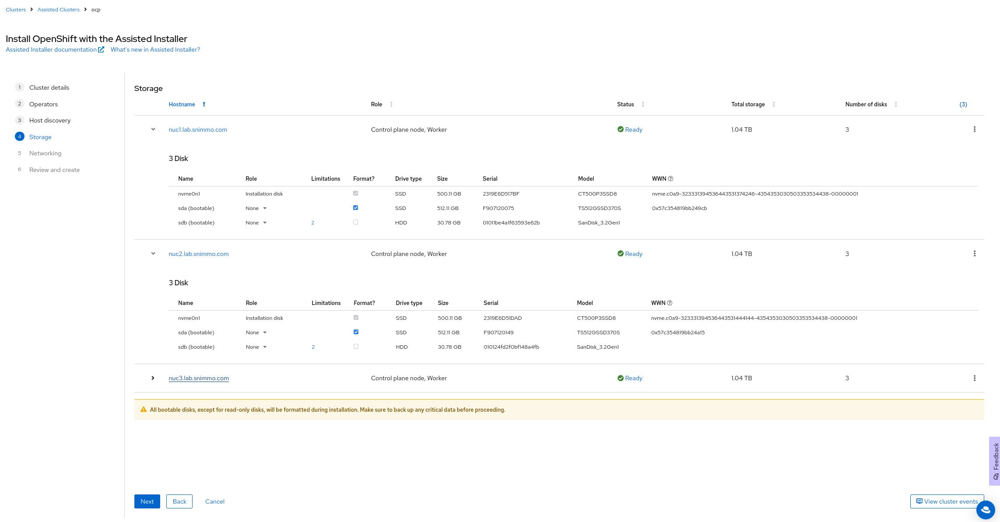

# Using the assisted installer

## Prerequisites

### Hardware

6 Nodes - 3 Control Plane, 3 Workers

For all nodes: 

* Networking (IPAM)
    * DHCP (Recommended)
    * Static: macaddress and IP address
* Disks
    * Install disk located at /dev/sda
    * For worker nodes, additional disk for ODF

### DNS

Two VIPs Needed

  * API: 
  * Ingress: 

# Install

Go to <a href="https://console.redhat.com/openshift/assisted-installer" target="_blank">https://console.redhat.com/openshift/assisted-installer</a>. Click on Create Cluster

Move to Datacenter tab and click on Create Cluster

Boot the boxes with the generated ISO and they will show up in the host inventory.

Select the Installaion disks and format the other disks (node 3 hidden for image sizing)

Fill out networking information

Review and press Install Cluster

Wait...

## Day 2 Tasks

<a href="https://docs.redhat.com/en/documentation/red_hat_openshift_data_foundation/4.15/html/deploying_openshift_data_foundation_using_bare_metal_infrastructure/deploy-using-local-storage-devices-bm" target="_blank">Install ODF</a>

<a href="https://docs.openshift.com/container-platform/4.15/registry/configuring-registry-operator.html" target="_blank">Configure the Registry</a>

